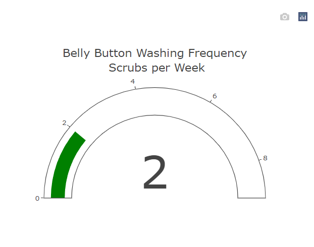
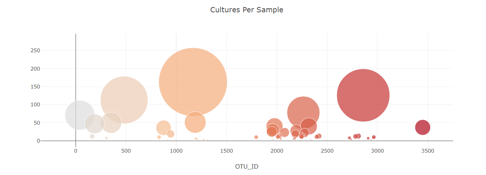

# Plotly-Biodiversity
Please view my dashboard webpage via the link below!
<https://zmeader.github.io/Plotly-Biodiversity/>

# Overview:
The objective of this project is to pull the JSON data related to belly button biodiversity and how the bacteria grows. The data source can be found via... <https://2u-data-curriculum-team.s3.amazonaws.com/dataviz-classroom/v1.1/14-Interactive-Web-Visualizations/02-Homework/samples.json>. By using this json data, a dashboard was created to better visualize the data for the user.

## Step 1 - Pulling the Data/Creating the DropDown
1. In order to create the webpage to visualize the data, d3 was used to pull the json data from the above url. `d3.json(url).then((Data) => {`

2. Once a connection has been established with the data, the drop down menu was created via ` dropDown.append('option').text(name).property('value', name);` which allows the user to naviagte between each subject id. 

## Step 2 - Create the Demo Table
1. The first visualization that was created was the demographic info table which provides information realted to the subject. By pulling the data from the json, via... `Object.entries(lineItem).forEach(([key, value]) => {panel.append('h6').text(${key.toUpperCase()}: ${value})` the user can have a better sense of the details for that specific subject.  

    

## Step 3 - Create the Visualizations
1. The first visualization created is a horizontal bar graph displaying the top 10 bacteria cultures per subject. In order to pull the proper data for the y-axis, a slice function is needed to access the number of each culture. `var ytick = otu_ids.slice(0,10).map(otuID => OTU ${otuID}).reverse();`.

    

2. The second visualization created is a gauge tracker which showcases the belly button washing frequency scrubs per week. The gauge chart is used in order for the amount to be promptly displayed. 

    

3. The last visualization is a bubble chart to display the difference in cultures per sample based on the subject. The larger the bubble, the more cultures were taken. 

    
